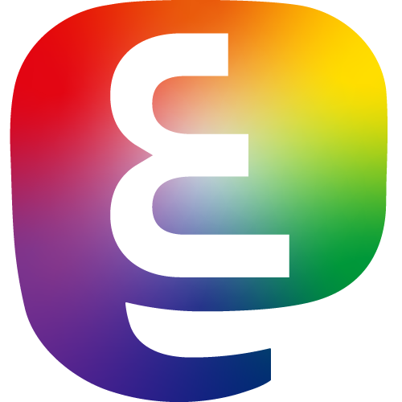

# arabi.gay Logo
The logo for https://arabi.gay. It's the [Mastodon mark-only logo](https://joinmastodon.org/branding), but the m is rotated on it's side and edited to look like the letter ع for عربي (arabi), and rainbow is added to the background. The background bubble-elephant-thing kinda looks like the letter م, so that almost completes the Arabic acronym for LGBT (م.ع).

